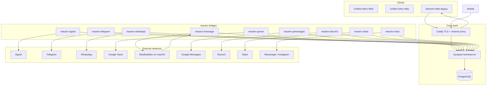

# Message Matrix

Self-hosted **Matrix** stack for power users who want one private inbox across messaging platforms — Signal, Telegram, WhatsApp, iMessage, Google Voice, Google Messages, Discord, Slack, Meta, and more.

## Connection Wizard

Interactive, plugin-style setup helpers for each platform:

```bash
./connect                 # Menu — pick a connection
./connect whatsapp        # Jump straight to WhatsApp wizard
./connect telegram
./connect status          # via menu option [s]
```

Each wizard walks through prerequisites, saves credentials to `.env`, initializes the bridge, registers it with Synapse, starts the container, and prints Element login steps.

| # | Platform | Wizard | Bot in Element |
|---|----------|--------|----------------|
| 1 | Signal | `./connect signal` | `@signalbot:yourdomain` |
| 2 | Telegram | `./connect telegram` | `@telegrambot:yourdomain` |
| 3 | WhatsApp | `./connect whatsapp` | `@whatsappbot:yourdomain` |
| 4 | iMessage (BlueBubbles) | `./connect imessage` | `@imessagebot:yourdomain` |
| 5 | Google Voice | `./connect gvoice` | `@gvoicebot:yourdomain` |
| 6 | Google Messages | `./connect gmessages` | `@gmessagesbot:yourdomain` |
| 7 | Discord | `./connect discord` | `@discordbot:yourdomain` |
| 8 | Slack | `./connect slack` | `@slackbot:yourdomain` |
| 9 | Meta (Messenger/IG) | `./connect meta` | `@metabot:yourdomain` |
| 10 | Snapchat | `./connect snapchat` | experimental — not production-ready |

Enabled bridges are tracked in `bridges/.enabled` and registered dynamically in Synapse.

## Unified Inbox (Web + Mac)

Custom Matrix client — **all messages in one three-panel inbox** (not a control dashboard).

| Panel | Purpose |
|-------|---------|
| **Left** | All conversations across platforms, search, platform filter chips |
| **Center** | Message thread + composer |
| **Right** | Contact profile + actions (mute, pin) |

- **Web:** `https://app.yourdomain.com` (via `INBOX_PUBLIC_URL` in `.env`)
- **Mac:** Tauri desktop app in `apps/inbox-desktop`

### Development

```bash
npm run install:all       # or: ./scripts/pnpm.sh install
npm run dev               # inbox web at http://localhost:5173
npm run dev:desktop       # Mac app (requires Rust)
npm run build:web         # production static build
npm run build:desktop     # Mac .app bundle
```

Without npm scripts: `./scripts/pnpm.sh install`, `./scripts/pnpm.sh --filter @message-matrix/inbox-desktop tauri build`

Monorepo layout: `packages/shared` (Matrix SDK, UI), `apps/inbox-web`, `apps/inbox-desktop`.

## Architecture



## What's included

| Component | Role |
|-----------|------|
| **Synapse** | Matrix homeserver — your data stays on your hardware |
| **Element Web** | Primary web client, locked to your homeserver |
| **Caddy** | TLS termination, `.well-known` Matrix discovery |
| **mautrix-signal** | Signal linked-device bridge |
| **mautrix-telegram** | Telegram puppeting bridge |
| **mautrix-whatsapp** | WhatsApp Web bridge |
| **mautrix-gvoice** | Google Voice SMS bridge |
| **mautrix-imessage** | iMessage via [BlueBubbles](https://bluebubbles.app) |
| **mautrix-gmessages** | Android RCS/SMS via Google Messages |
| **mautrix-discord** | Discord puppeting bridge |
| **mautrix-slack** | Slack workspace bridge |
| **mautrix-meta** | Messenger / Instagram DMs |
| **./connect** | Interactive wizard for all of the above |
| **Snapchat** | Experimental placeholder — `./connect snapchat` explains limits |

**Privacy defaults:** open registration off, federation disabled by default, no Element analytics, custom URLs disabled so users can't accidentally point at matrix.org.

## Prerequisites

- Docker Engine 24+ and Docker Compose v2
- A domain (public) or local DNS (LAN-only)
- For **Telegram**: API ID + hash from [my.telegram.org](https://my.telegram.org/apps)
- For **iMessage**: a Mac (or macOS VM) running [BlueBubbles Server](https://docs.bluebubbles.app/)
- For **Google Voice**: consumer accounts may need Electron headless — see `bridges/gvoice/README.md`
- Optional: [yq](https://github.com/mikefarah/yq) for automated bridge config patching

## Quick start

```bash
cp .env.example .env
# Edit .env — set domains, passwords, Telegram credentials, BlueBubbles URL

chmod +x scripts/*.sh connect
./scripts/bootstrap.sh
./connect
```

Bootstrap starts the core stack only. Use **`./connect`** to add platforms one at a time (recommended) or run `./connect` → `[a]` to walk through all unconfigured bridges.

## Bridge authentication

Wizards print platform-specific steps. In general, after `./connect <platform>`:

1. Open Element at your configured URL
2. DM the bridge bot (see table above)
3. Send `login` and follow prompts (QR code, OAuth, phone code, etc.)

Manual reference: [mautrix bridges](https://docs.mau.fi/bridges/)

## Adding more bridges later

1. Add the bridge id to `scripts/lib/bridges.sh` if not already listed
2. Add a Docker service in `docker-compose.yml`
3. Create `scripts/wizards/<id>.sh` following existing wizards
4. Run `./connect <id>`

See `bridges/_placeholders/README.md` for Snapchat and other experimental options.

## Directory layout

```
.
├── connect                   # Connection wizard entry point
├── docker-compose.yml
├── scripts/
│   ├── connect-wizard.sh     # Interactive menu
│   ├── init-bridge.sh
│   ├── render-synapse-config.sh
│   ├── lib/                  # Bridge registry + UI helpers
│   └── wizards/              # One wizard per platform
├── bridges/
│   ├── .enabled              # Active connections list
│   └── {signal,telegram,whatsapp,...}/
```

## TLS options

**LAN / private (default):** `CADDY_TLS_MODE=internal` — Caddy issues a local CA. Install the root cert on your devices.

**Public domain:** set `CADDY_ACME_EMAIL` and remove or change the TLS mode in `caddy/Caddyfile` to use Let's Encrypt. Point DNS:

- `matrix.example.com` → your server
- `chat.example.com` → your server

## Security notes

- Bridges disable Matrix E2EE for portal rooms by default (`encryption.allow: false`) — required for reliable bridging. Your Synapse instance is still private; traffic to remote networks is governed by each platform's security model.
- Keep `.env`, `registration.yaml`, and bridge configs out of git (see `.gitignore`).
- iMessage via BlueBubbles requires a signed-in Apple ID on macOS — treat that host as trusted infrastructure.
- Review [Synapse hardening](https://element-hq.github.io/synapse/latest/usage/configuration/hardening.html) before exposing federation publicly.

## Operations

```bash
# Logs
docker compose logs -f synapse
docker compose logs -f mautrix-telegram

# Update images
docker compose pull && docker compose up -d
docker compose --profile bridges pull && docker compose --profile bridges up -d

# Restart a single bridge after config change
docker compose restart mautrix-signal
```

## License

Bridge images and Synapse are AGPL-licensed upstream. This deployment scaffolding is provided as-is for self-hosting.
